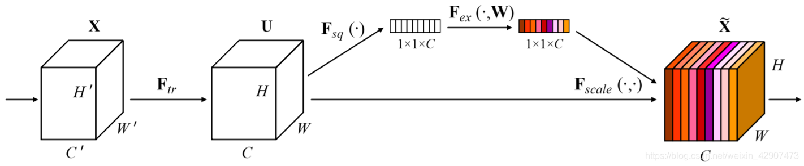
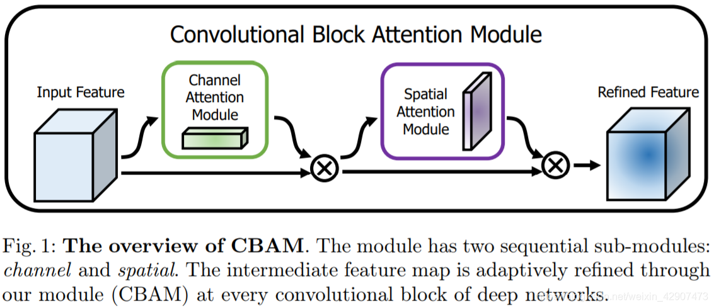

# 注意力机制模块

> [CV领域常用的注意力机制模块（SE、CBAM）](https://blog.csdn.net/weixin_42907473/article/details/106525668)

## SE模块（Squeeze-and-Excitation Networks）

关注channel之间的关系，希望模型可以学习到不同channel特征的重要程度，从而提高模型的泛化能力。

一个SEblock的过程分为 Squeeze(压缩) 和 Excitation(激发) 两个步骤：

- Squeeze(压缩) 通过在Feature Map层上执行Global Average Pooling，得到当前Feature Map的全局压缩特征量；

- Excitation(激发) 通过两层全连接的bottleneck结构得到Feature Map中每个通道的权值，并将加权后的Feature Map作为下一层网络的输入。

## CBAM模块（Convolutional Block Attention Module）

在通道和空间维度进行attention操作。

