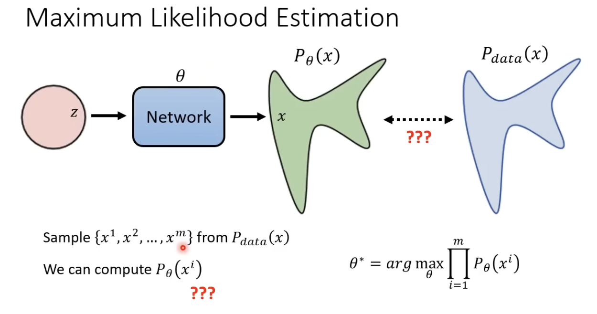
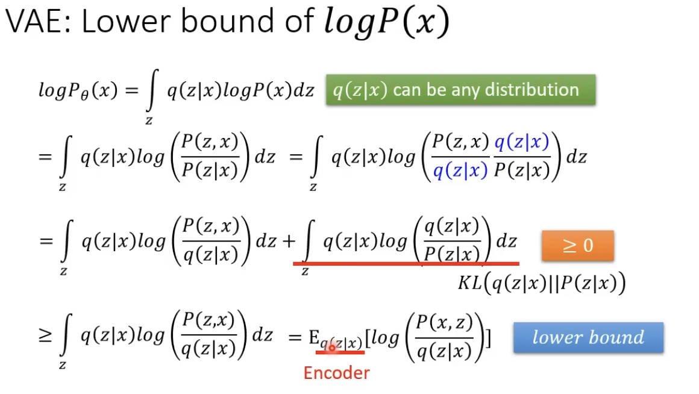
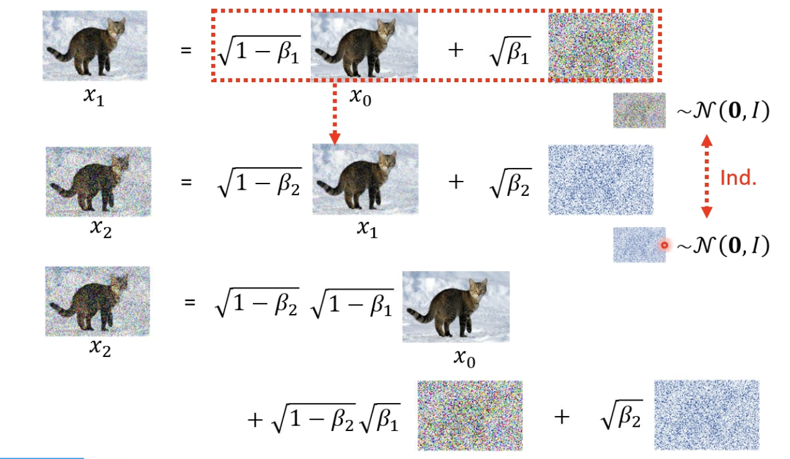

# 李宏毅Diffusion Model笔记

## Basics

Denoise model：

- 输入一个noised image， 和一个step
- noise predeictor输出noise
- noised image - noise

- Text-To-Image：
  - Trained from LAION（5.85B）
  - 给noise predictor多一个输入：text
- Stable Diffusion
  - Framework: "A cat in the snow" -> Text Encoder -> Generation Model -> latent representation -> Decoder -> image
- Dall-E
- FID
  - Frechet Inception Distance
  - distance between two Guassians, smaller is better
    - red points: real images
    - blue points: generated images
  - 需要生成大量的images
- CLIP: Contrastive Language-Image Pretraining
  - 一个图片和一个文本，然后判断这两个是否相关
  - "A cat in the snow" -> Text Encoder
  - Image("A cat in the snow") -> Image Encoder
- Latent Representation
  - image -> Encoder -> Latent Representation -> decoder -> image

## Diffusion Model的数学原理

Maximum Likelihood Estimation

Maximum Likelihhod = Minimize KL Divergence

- What is KL divergence?

VAE:

DDPM:

## Addition

- Diffusion Model for Speech
  - WaveGrad
- Diffusion Model for Text
  - Diffusion-LM
  - DiffuSeq
  - DiffusER
- Mask-Predict
